# Context Capture Center 安装教程

**⚠本教程仅供学习交流使用**	<a href="https://blog.csdn.net/qq_38721452/article/details/103594714" target="_blank">参考教程</a>

------

> **①下载** <a href="https://cloud.189.cn/web/share?code=JrqqYbJVVjqm" target="_blank">【天翼云下载】</a>

------

> **②安装**
>
> 
>
> 1、解压下载好的安装包，双击 **Context Capture Center 64-bit Setup.exe** 进行安装 
>
> 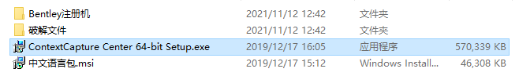
>
> 2、勾选 我同意..（I Agree ..），点击 安装（Install）
>
> 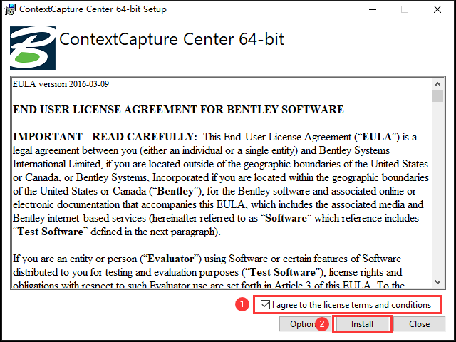
>
> 3、正在安装中
>
> 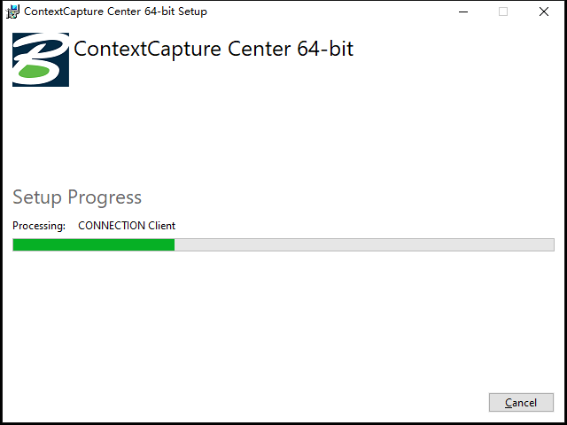
>
> 4、接下来会弹出一个小窗口，点击 下一步（Next）即可
>
> 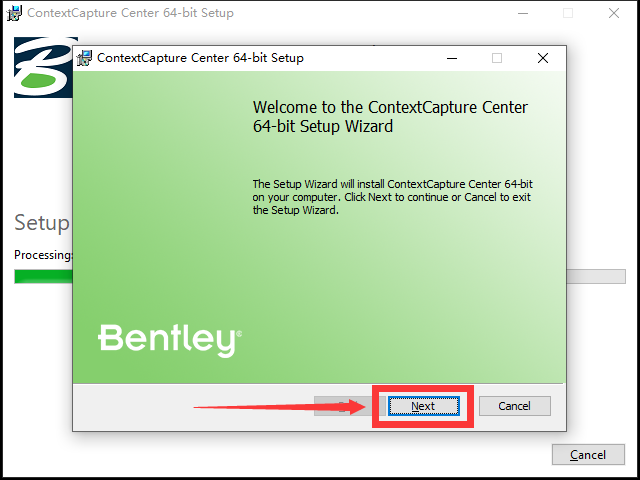
>
> 5、默认安装路径不要动，否则会影响后续的汉化工作。点击 下一步（Next）继续安装
>
> 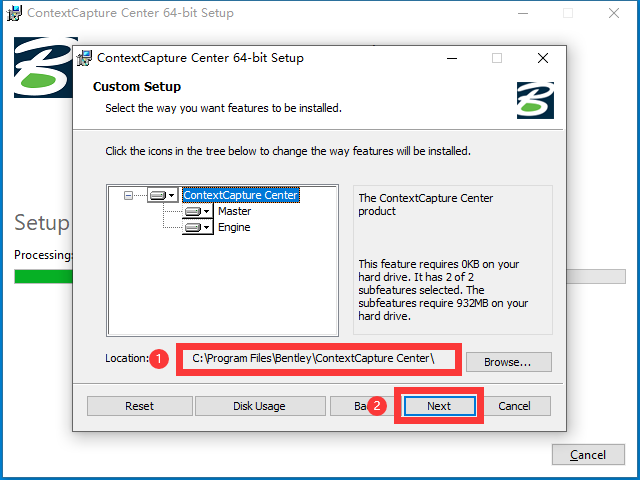
>
> 6、点击 install 进行安装
>
> 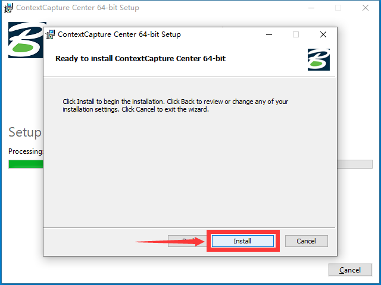
>
> 7、安装中
>
> 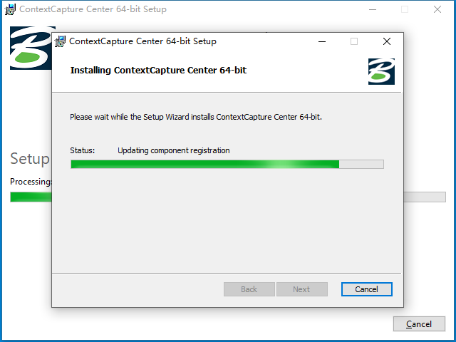
>
> 8、安装完成，点击 Finish
>
> 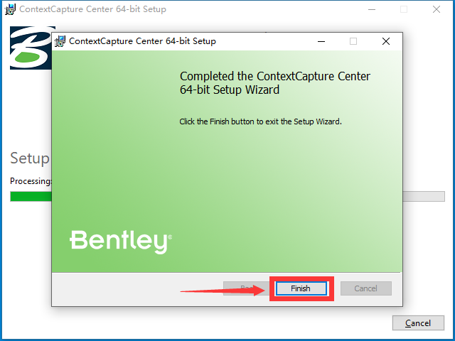
>
> 9、不需要安装 python ，点击取消 （Cancel）即可
>
> 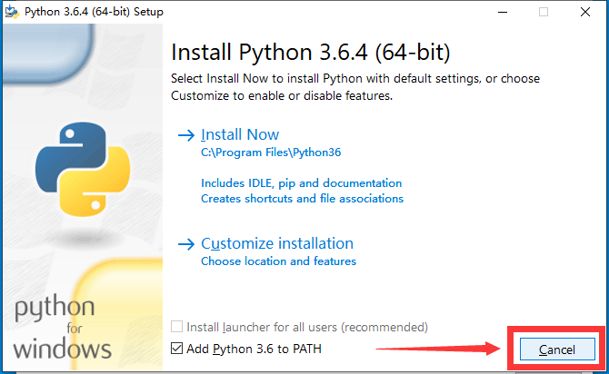
>
> 10、安装完成，点击 Close 关闭安装程序
>
> 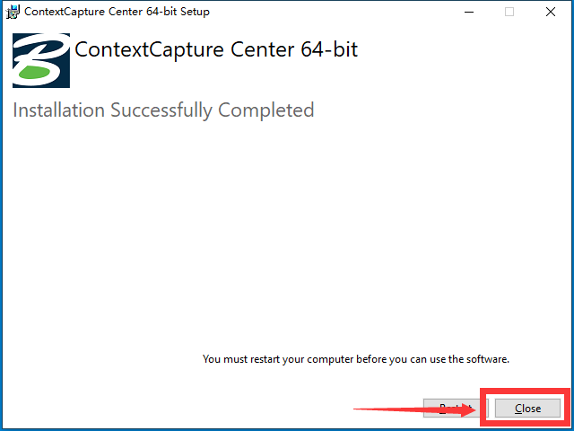
>
> 11、此时你会发现电脑桌面上多出来四个图标，这就表示安装过程完成了
>
> 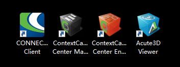

------

> **③破解**
>
> 
>
> 将安装包 **破解文件** 文件夹下的两个文件复制替换到软件的安装目录即可完成破解
>
> 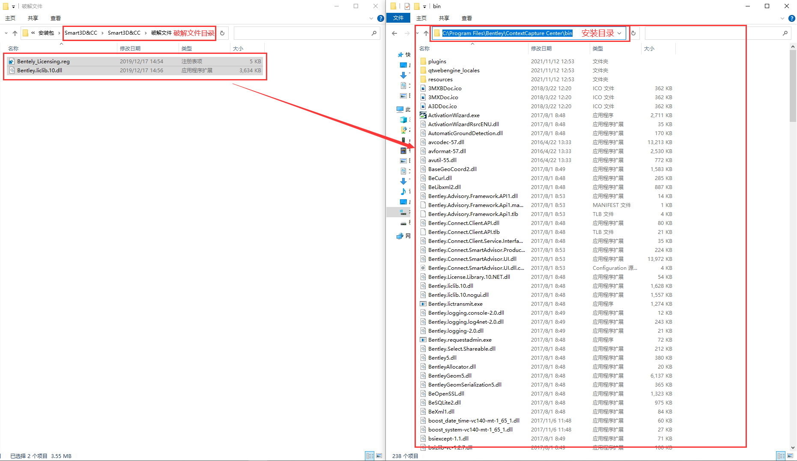
>
> 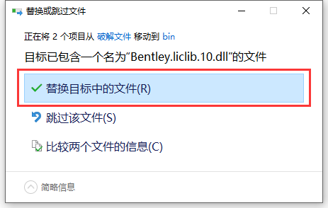

------

> **④汉化**
>
> 
>
> 1、双击安装目录下的 **中文语言包.msi**
>
> 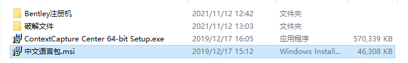
>
> 2、点击 Next
>
> 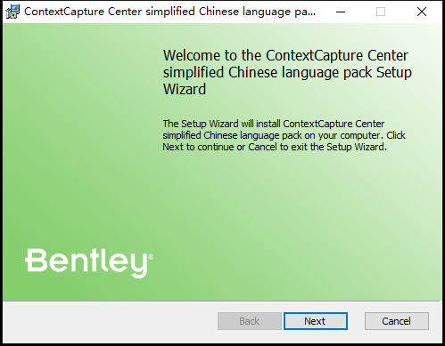
>
> 3、勾选 我接受.（I accept .）, 点击Next
>
> 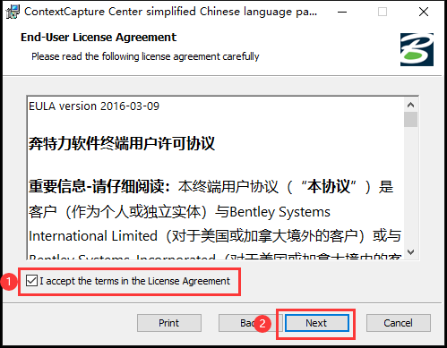
>
> 4、继续点击 Next
>
> 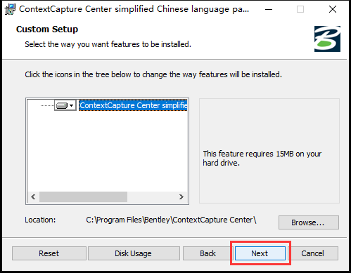
>
> 5、点击 Install
>
> 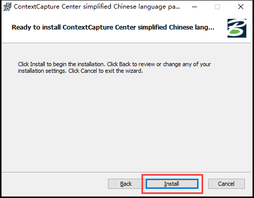
>
> 6、点击 Finish 即可关闭中文语言包安装程序
>
> 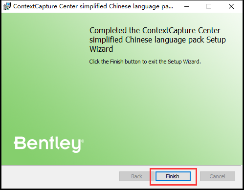

------

> **⑤查看安装结果**
>
> 
>
> 1、点击桌面上 **ContextCapture Center Master** 的图标
>
> 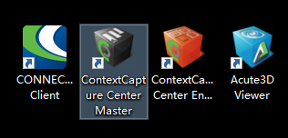
>
> 2、点击 帮助>关于 即可看到汉化及破解已完成
>
> 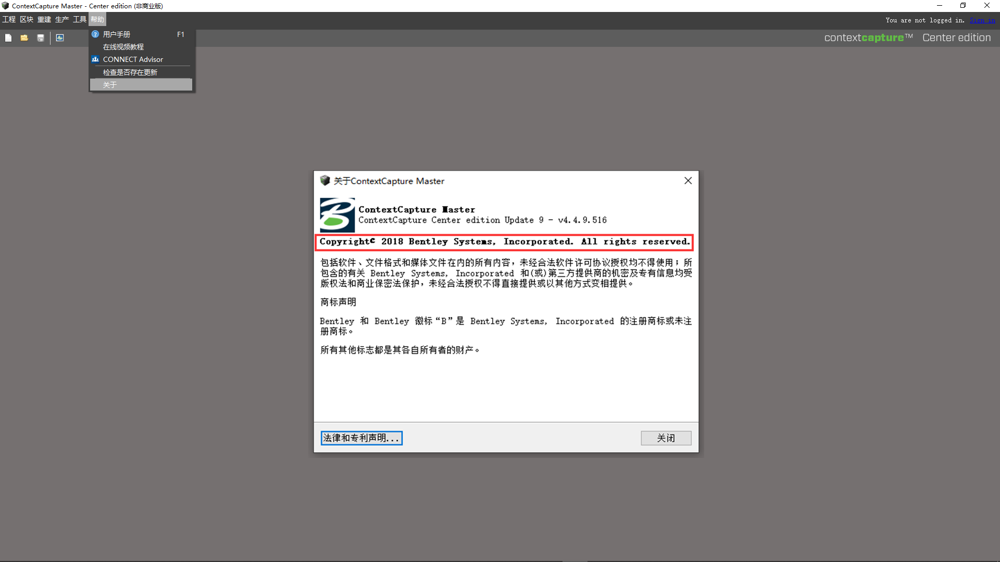

